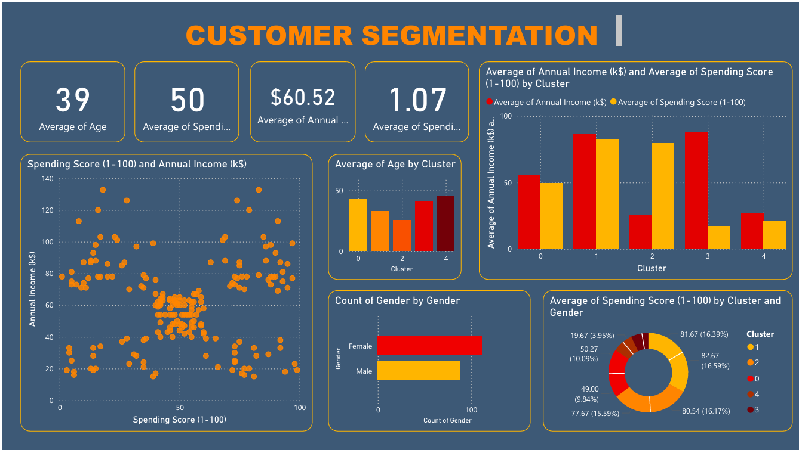

# 🎯 Customer Segmentation Project

[**Power BI tương tác →**](https://ndq-wpz.github.io/Customer-Segmentation/)
## Problem Framing 
**Business Question:**  
"Tăng hiệu quả marketing 15% dựa trên phân nhóm khách hàng theo hành vi chi tiêu"

**Success Metrics:**  
- Xác định 5 phân khúc khách hàng (K_mean = 5)  
- Bộ dự liệu sau phân nhóm
[**Chi tiết Problem Framing →**](docs/Problem_Framing.md)

## Tổng hợp
- **Báo cáo trực quan hóa:**  
[**Chi tiết Visualize →**](https://ndq-wpz.github.io/Customer-Segmentation/)  
[**Chi tiết Khách hàng phân nhóm →**](data/processed/customers_with_clusters.csv)  
[**Chi tiết Final Report →**](Final_report.md)  

---
## **Cấu trúc Dự án**

```plaintext
customer-segmentation/
├── 📂 docs/
│   ├── 📂 raw                           # Chứa file dữ liệu gốc
│   └── 📂 processed                     # Chứa dữ liệu đã qua xử lý
│        ├── cleaned_data.csv                    # Dữ liệu đã được làm sạch
│        └── standardize_data.csv                # Dữ liệu đã chuẩn hóa
│        └── standardize_data.csv                # Dữ liệu đã chuẩn hóa
│        └── customers_with_clusters.csv         # Dữ liệu đã phân nhóm, sẵn sàng trực quan hóa và phòng mar có thể dùng
├── 📂 notebooks/                        # Thư mục triển khai Jupyter Noteboook
│   ├── 1_Data_Cleaning.ipynb                   # Notebook xử lý dữ liệu thô, làm sạch 
│   ├── 2_EDA.ipynb                             # Notebook thực hiện phân tích khám phá dữ liệu (EDA)
│   └── 3_Clustering_Model.ipynb                # Notebook thực hiện phân nhóm khách hàng
├── 📂 report/
│   ├── 📂 figures/                            # Thư mục chứa các biểu đồ và hình ảnh trực quan hóa kết quả.
│   └── 📂 results/                            # Chứa tài liệu báo cáo kết quả phân tích dữ liệu.     
│       └── EDA/                                    # Tổng hợp kết quả từ giai đoạn phân tích khám phá dữ liệu. 
│        │   └── 📂 Elements/                             # Hình ảnh/ minh họa cho phân tích EDA
│        │   └── eda_summary.md                           # Tóm tắt kết quả phân tích khám phá dữ liệu (EDA) 
│        └── data_sample.ipynb
│        ├── cluster_summary.md                  # Tóm tắt dữ liệu khác hàng phân nhómnhóm
│        ├── final_report.pdf                    # Báo cáo tổng hợp cuối cùng về phân nhóm khách hàng.
│        └── visualize_by_PBI.pdf           # Visualize bằng Power BIBI
├── 📂 src/
│   ├── data_preprocessing.py                   # Script tiền xử lý dữ liệu.
│   ├── visualization.py                        # Script tạo biểu đồ, phân tích cụm và tính toán độ hiệu quả của mô hình clustering.  
├── requirements.txt                       # Danh sách các thư viện Python cần thiết để chạy dự án.
├── .gitignore.md
└── README.md                              # Hướng dẫn tổng quan về dự ámd)

```
## Ref
### 1. **Nguồn dữ liệu**  
- Raw data được lấy từ [Kaggle](https://www.kaggle.com/)

### 2. **Tools**  
- **Python & Jupyter Notebook**: Xử lý dữ liệu và xây dựng mô hình.  
- **Pandas, NumPy, Scikit-learn**: Phân tích dữ liệu và phân nhóm.  
- **Matplotlib & Seaborn**: Trực quan hóa 
