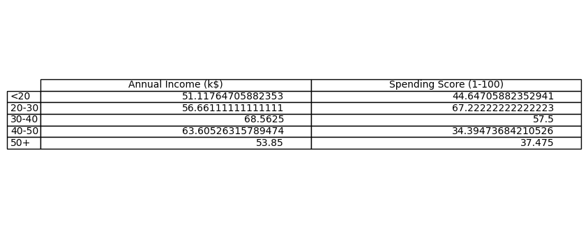
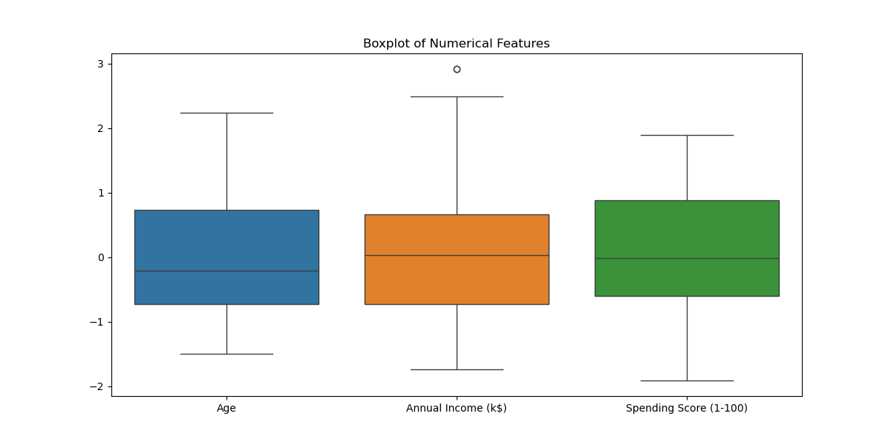
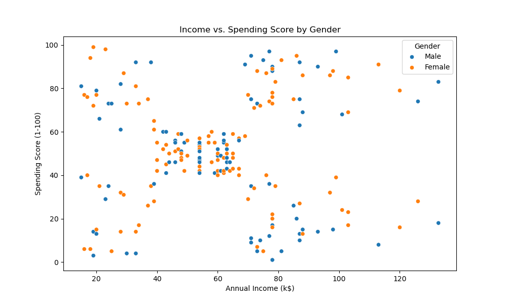
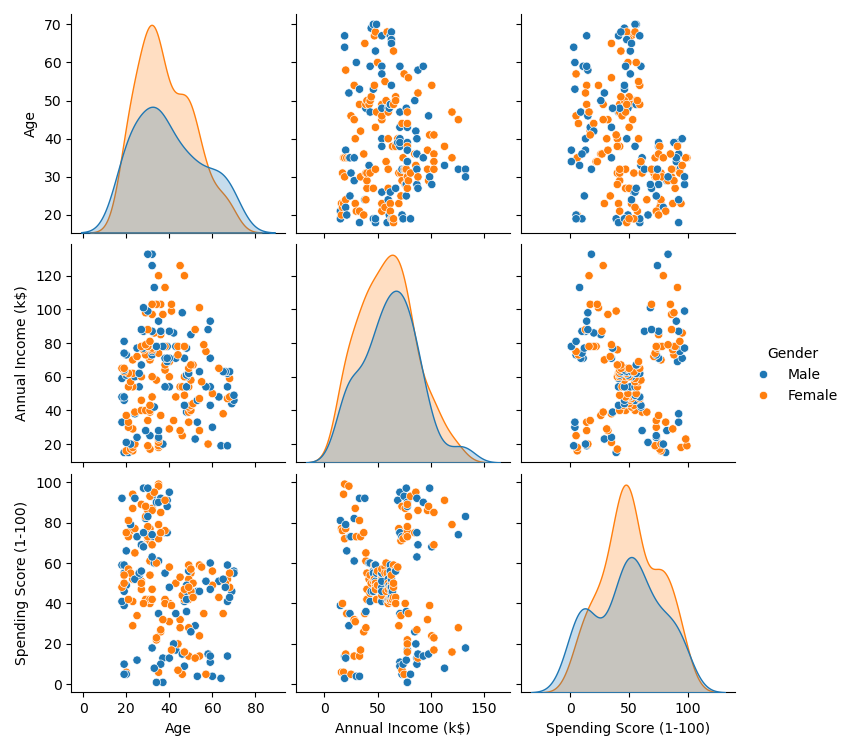

# Exploratory Data Analysis (EDA)

## Age distribution

   - 65% khách hàng trong độ tuổi 20-40.
   - Nhóm dưới 20 tuổi có điểm chi tiêu cao nhất (77/100).
## Annual Income (k$) distribution
_distribution.png)
   - 5 cụm rõ rệt → Tiềm năng phân nhóm bằng K-Means.  
## Spending Score (1-100) distribution
_distribution.png)
   - Nữ chi tiêu trung bình 55 điểm, nam 45 điểm.
## age group stats

   - Tuổi và Điểm chi tiêu có tương quan âm (-0.47).
## boxplot outliers

## correlation heatmap

## distributions

## gender spending

## income vs spending

## pairplot

## Action Items
- Tập trung phân tích 2 biến **Income** và **Spending Score** để phân cụm.
- Loại bỏ 3 outliers trong Annual Income.